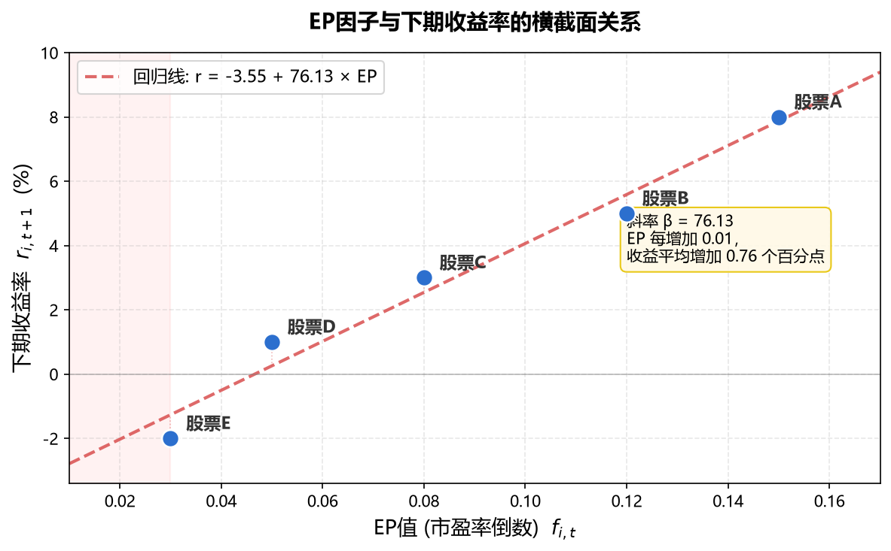

# 第3章：因子的本质——从直觉到严格定义

> **前置知识**：第1-2章内容（量化投资基本概念、CAPM与多因子模型的历史背景）；线性代数基础（矩阵运算、向量空间）；概率统计基础（期望、方差、协方差、回归分析）
>
> **学习目标**：理解"因子"的严格数学定义；掌握从投资组合理论到因子模型的逻辑推导；理解因子溢价的三种理论来源；建立评价因子优劣的分析框架

---

## 3.1 什么是"因子"——从投资直觉出发

### 3.1.1 一个简单的观察

假设你是一个股票投资者，你观察了A股市场3000多只股票，发现一个有趣的现象：

- 把所有股票按市盈率（PE）从低到高排序，分成5组
- 过去10年里，PE最低的那组股票（最"便宜"的），平均每年回报率系统性地高于PE最高的那组（最"贵"的）

让我们把这个观察具体化。假设2014年1月1日，你做了以下操作：

| 组别 | PE范围（示例） | 代表性股票（举例） | 2019-2024年均收益 |
|------|--------------|-------------------|-----------------|
| 第1组（最便宜） | PE < 10 | 银行、煤炭、钢铁 | +6.7% |
| 第2组 | 10 ≤ PE < 20 | 家电、建筑 | +8.6% |
| 第3组 | 20 ≤ PE < 35 | 医药、食品 | +6.3% |
| 第4组 | 35 ≤ PE < 60 | 新能源、半导体 | +6.6% |
| 第5组（最贵） | PE > 60 | 概念股、次新股 | +5.1% |

*数据来源：基于tushare全A股2019-2024年数据，每年末按PE_TTM分5组，计算次年等权平均收益后取5年均值。代码见 `book/code/verify_all.py`。*

> **注意**：近5年（2019-2024）PE效应显著弱化——低PE组仅比高PE组年均多赚约1.5个百分点。这与2010-2016年间低PE组大幅跑赢（年均8-10个百分点）形成鲜明对比。原因包括：(1) 注册制改革后壳价值消退，小市值"垃圾股"不再被炒作；(2) 2020-2021年"赛道股"行情中，高PE成长股大幅跑赢价值股；(3) 量化基金大量使用PE因子后，溢价被部分套利掉。这正是第3章§3.5.3讨论的"因子衰减"现象的真实案例。


观察这张表，一个清晰的模式浮现：**从第1组到第5组，PE逐渐升高，收益率逐渐降低**。这种跨组的系统性差异不是偶然的——它年复一年地重复出现（虽然幅度不同）。

这个观察引出一个核心问题：**为什么某些可观测的股票特征，能够系统性地预测未来收益？**

这里的"可观测特征"就是我们所说的**因子**（Factor）的直觉来源。但直觉不够——我们需要一个严格的数学框架来定义它、量化它、检验它。

### 3.1.2 从"特征"到"因子"的概念跃迁

在日常语言中，我们可能说"这只股票很便宜"或"这家公司增长很快"。这些描述对应着一些可以计算的数值指标：市盈率、市净率、营收增长率、过去一年的涨跌幅……

但并非所有可计算的指标都是"因子"。让我们做一个思想实验来理解这一点：

**思想实验**：假设你计算了A股3000只股票的"股票代码尾数"（比如000001的尾数是1，600519的尾数是9）。这也是一个"可观测的数值指标"——但它显然不应该能预测收益率。如果你发现"尾数为7的股票过去一年回报率最高"，那几乎可以肯定是巧合（随机噪声），而非真实的预测能力。

一个指标要成为因子，它必须满足一个关键条件：**它与未来收益率之间存在可预测的、稳定的统计关系，且这种关系有合理的经济学解释**。

用更精确的语言说：

> **定义（非正式）**：因子是一个股票横截面上的可观测变量 $f$，使得在条件 $f$ 上，不同股票的预期收益率存在系统性差异。

"横截面"这个词很关键。它的意思是"在同一时刻，跨越不同股票来看"。与之相对的是"时间序列"（对同一只股票，跨越不同时间来看）。因子投资的核心是横截面比较——在众多股票中，找出哪些特征能区分出未来赢家和输家。

这个定义还不够严格。接下来我们将从数学上精确化它。

### 3.1.3 为什么需要数学形式化？

你可能会问：我已经观察到了"便宜股跑赢昂贵股"的规律，直接按PE排序买入不就行了？为什么还需要数学推导？

原因有三：

**原因1：量化"有效"的程度**。PE最低组比最高组每年多赚8%——但这个数字可靠吗？如果明年只多赚1%或者反过来亏了，那这个"规律"就不值得依赖。我们需要统计工具来量化"这个规律有多可靠"。

**原因2：多因子组合**。当你同时发现PE低有效、动量也有效、ROE高也有效，你如何把它们组合起来？三者之间是否有重叠（比如PE低的股票可能ROE也低）？数学框架让我们能严格处理因子间的相互关系。

**原因3：理解"为什么"**。知道"便宜股跑赢"还不够——你需要知道"为什么"它能跑赢。是因为承担了更大的风险（所以这个超额收益是合理的风险补偿）？还是因为市场犯了系统性的错误（所以这是可以被"白赚"的alpha）？不同的答案对投资策略有完全不同的含义。

---

## 3.2 因子的数学形式化：横截面回归模型

> 📌 **本节要解决的问题**：我们发现"PE低的股票未来涨得多"，但这个规律到底有多强、多稳定？能不能用一个数字精确描述？
>
> **我们的做法**：把3000只股票的因子值（比如EP）和下个月收益画成散点图，拟合一条直线，看斜率是多少
>
> **得到的结论**：斜率β就是"因子收益率"，它直观的反映了EP每高0.01，下个月平均多赚多少。β越大说明这个因子越有效
>
> 以上是结论，以下为推导，读者可自行选择是否跳过该推导过程，继续阅读 3.2.1 节。

现在让我们把直觉转化为数学。

考虑在时刻 $t$，市场上有 $N$ 只股票。对于第 $i$ 只股票，我们观察到：
- $r_{i,t+1}$：从 $t$ 到 $t+1$ 的收益率（这是我们要预测的）
- $f_{i,t}$：在时刻 $t$ 可观测到的某个特征值（比如市盈率的倒数）

**关键时间约定**：因子值 $f_{i,t}$ 必须在时刻 $t$ 就能观测到（即"已知信息"），而收益率 $r_{i,t+1}$ 是未来才实现的。如果用未来的信息来"预测"，那就不是预测而是作弊——这就是后面会反复提到的"前视偏差"。

举个具体例子：如果我们用2024年3月31日发布的年报数据（属于2023年的财务数据）来预测2024年4月的收益率，这是合法的——因为年报在3月底前已经公开了。但如果我们用2024年4月30日才发布的一季报数据来"预测"2024年4月的收益——这就是前视偏差。

我们建立最简单的线性模型：

> 下一期收益 = 市场平均收益 + 因子"单价" × 因子值 + 乱七八糟的噪音。比如你用 EP 因子去预测下个月哪只股票涨得多。模型说所有股票先有一个基础收益垫底（$\alpha$），然后 EP 高的股票额外加分（$\beta \times EP$），还有一些随缘因素（$\epsilon$）。比如茅台 EP=0.05，那模型预测的额外加分就是 0.05 × $\beta$。

$$r_{i,t+1} = \alpha_t + \beta_t \cdot f_{i,t} + \epsilon_{i,t+1} \tag{3.1}$$

其中：
- $\alpha_t$（截距）：当期所有股票的平均收益水平。等效于"什么都不管、闭眼买所有股票，大概能赚多少"，这是市场的"底薪"
- $\beta_t$（因子收益率）：因子值每增加 1，预期收益增加多少。如果 $\beta_t = 1.2$，就是说 EP 从 0.05 涨到 0.06（变便宜了 0.01），下月收益平均多 1.2 个百分点。$\beta_t$ 是回归的**斜率**，决定了因子的"威力"
- $\epsilon_{i,t+1}$（残差）：因子解释不了的部分——老板被抓了、工厂烧了、被游资盯上了、国家出政策了……所有这些随机事件打包进 $\epsilon$。好的因子，$\epsilon$ 应该像白噪音一样毫无规律

**直觉理解**：想象你画一张散点图，横轴是各股票的因子值 $f_{i,t}$，纵轴是它们的下一期收益率 $r_{i,t+1}$。如果散点呈现出明显的线性趋势，那说明这个因子"有效"——斜率 $\beta_t$ 就是因子的"力量"。

让我们用一个微型例子来具体化。假设在2024年1月底，我们观察5只股票的EP值（市盈率倒数）和它们在2024年2月的收益率：

| 股票 | EP值 ($f_{i,t}$) | 2月收益率 ($r_{i,t+1}$) |
|------|---------|------------|
| A | 0.15 | +8% |
| B | 0.12 | +5% |
| C | 0.08 | +3% |
| D | 0.05 | +1% |
| E | 0.03 | -2% |

将上表中的离散数据绘制成散点图，并叠加上 OLS 回归拟合的直线，可以更直观地看到线性趋势：



目测可以看出EP越高、收益越高，这就是"价值因子有效"的具体表现。回归后得到的 $\hat{\beta}_t$ 就量化了EP每增加0.01对应多少额外收益（图中斜率为 76.13，意味着EP每增加0.01，下月收益平均上升约 0.76 个百分点）。

### 3.2.2 推导过程：从条件期望到 OLS 估计

> 📌 **本节要解决的问题**：散点图上的"最佳拟合直线"到底怎么画出来的？为什么用这个方法？
>
> **我们的做法**：用最小二乘法（OLS）——让所有点到直线的距离之和最小，这样拟合出来的斜率最"公平"
>
> **得到的结论**：斜率β = 因子值与收益的协方差 ÷ 因子值的方差。简单说：因子值和收益越"同涨同跌"，β越大；因子值本身越分散，β越精确
>
> 以上是结论，以下为推导，读者可自行选择是否跳过该推导过程，继续阅读 3.2.3 节。

**假设 3.1**（线性条件期望）：给定因子值 $f_{i,t}$，股票 $i$ 的预期超额收益为因子值的线性函数：

> 如果你知道了某只股票的因子值，比如 EP = 0.10（10 块钱买 1 块盈利），那你就能估算出它"数学上大概率能涨多少"。因子值越大，预期收益越高（或越低，取决于 $\beta_t$ 的符号）。公式 (3.2) 去掉了 (3.1) 里的噪音 $\epsilon$，只留下"预期"部分，就好比你不可能提前知道明天上班会不会遭遇交通事故（那是 $\epsilon$），但你大概知道这条路走到公司的平均时间是 20 分钟（那是 $\alpha + \beta \times 距离$）。

$$E[r_{i,t+1} | f_{i,t}] = \alpha_t + \beta_t \cdot f_{i,t} \tag{3.2}$$

其中：
- $E[r_{i,t+1} | f_{i,t}]$：在已知因子值 $f_{i,t}$ 的条件下，股票 $i$ 下一期收益的**数学期望**。"已知 EP 的情况下，这堆类似的股票历史上平均涨了多少"
- $\alpha_t$ 和 $\beta_t$：与 (3.1) 相同——底薪和因子单价

这个假设意味着我们相信"因子值与预期收益之间是线性关系"。这当然是一个简化——现实中可能是非线性的（第15章会讨论）——但线性假设是一个有力的起点，原因如下：

1. **线性是非线性的一阶近似**：即使真实关系是曲线，在局部范围内线性总是合理的近似（泰勒展开的第一项）
2. **统计上更稳健**：线性模型的参数少，不容易过拟合
3. **经济上可解释**：因子收益率 $\beta_t$ 有清晰的"每单位因子暴露对应多少收益"的含义

在这个假设下，对于给定时刻 $t$ 的横截面数据 $\{(f_{i,t}, r_{i,t+1})\}_{i=1}^{N}$，我们用**普通最小二乘法（OLS）**估计 $\beta_t$。OLS的目标是最小化残差平方和：

> 现在给定几千只股票，我们有了两张表：一列因子值、一列下期收益。我们的任务是找到一条直线，让所有数据点到这条直线的"竖直距离的平方和"最小。为什么用平方？因为距离有正有负（点在线上方为正，下方为负），直接加起来会正负相消，平方后全变成正数，离群的点（离得远）惩罚特别重。
>
> 举个例子：选了 3000 只 A 股，EP 作为因子，2 月收益作为预测目标。给每一只股票算 $r - \alpha - \beta \times EP$（实际收益偏离直线的距离），平方后全加起来。$\alpha$ 和 $\beta$ 就是那个让这笔"总偏离罚款"最小的组合。找到的 $\beta$ 就是"EP 的收益率"——EP 每高 0.01，预期多赚多少个百分点。

$$\min_{\alpha_t, \beta_t} \sum_{i=1}^{N} (r_{i,t+1} - \alpha_t - \beta_t f_{i,t})^2$$

对 $\beta_t$ 求导并令其为零，经过标准的线性代数运算（此处省略中间步骤，你应该在本科统计课上见过这个推导），得到：

$$\hat{\beta}_t = \frac{\sum_{i=1}^{N}(f_{i,t} - \bar{f}_t)(r_{i,t+1} - \bar{r}_{t+1})}{\sum_{i=1}^{N}(f_{i,t} - \bar{f}_t)^2} \tag{3.3}$$

其中 $\bar{f}_t = \frac{1}{N}\sum_i f_{i,t}$，$\bar{r}_{t+1} = \frac{1}{N}\sum_i r_{i,t+1}$。

**识别关键结构**：注意公式 (3.3) 的分子——它恰好是因子值与收益率的**样本协方差**（乘以 $N-1$）。分母是因子值的**样本方差**（乘以 $N-1$）。所以：

$$\hat{\beta}_t = \frac{\text{Cov}(f_t, r_{t+1})}{\text{Var}(f_t)} \tag{3.4}$$

这就是我们熟悉的回归系数公式。让我们深入理解它的含义：

- **分子 $\text{Cov}(f_t, r_{t+1})$**：因子值与收益率的共同变动。如果EP高的股票收益也高，协方差为正。
- **分母 $\text{Var}(f_t)$**：因子值本身的分散程度。这是一个"标准化"——如果因子值本身就很分散（方差大），那同样的协方差对应的斜率就小。

**直觉**：$\beta_t$ 回答的问题是"因子值比平均高出一个标准差的股票，收益率比平均高出多少？"——用因子值自身的离散程度做了标准化。

用我们前面的5只股票例子验算：$\bar{f} = 0.086$，$\bar{r} = 3\%$，代入公式可以算出 $\hat{\beta}_t \approx 0.77$——即EP每增加0.01，预期月收益增加0.77个百分点。

### 3.2.3 从单因子到多因子：自然的推广

> 前面我们只用了一个因子（比如EP）来预测收益。但你炒股时肯定会同时关注很多指标——这只股票便不便宜？最近涨势如何？公司盈利能力强不强？每个指标都可能提供一部分预测信息。问题是：怎么把多个指标的信息**同时**放进一个模型里，让它们各自发挥作用又不互相打架？答案就是多元回归——把散点图从二维升级到高维。

现实中，影响股票收益的因子不止一个。如果我们同时考虑 $K$ 个因子 $f_1, f_2, ..., f_K$：

> 一只股票的预期收益 = 底薪 + 因子1单价 × 因子1值 + 因子2单价 × 因子2值 + …… + 噪音。多个因子不是互相替代，而是**各自解释一部分**——当你同时知道"便宜"和"过去涨得好"两个信息，预测比只用其中一个更准。
>
> 选三只股票，同时看三个因子：EP（价值因子，市盈率倒数，前面已介绍）、MOM（动量因子 = Momentum，即过去一段时间的累计涨跌幅，后续详述）、ROE（质量因子，净资产收益率 = 净利润 ÷ 净资产）：
>
> - 茅台：EP=0.03（贵），MOM=0.15（近期涨得好），ROE=0.30（赚钱效率极高）
> - 某银行：EP=0.12（便宜），MOM=-0.05（最近跌了），ROE=0.10（赚钱效率一般）
> - 某垃圾股：EP=0.02（贵），MOM=-0.30（狂跌），ROE=-0.05（亏钱）
>
> 三因子模型会给每只股票算一个总分：$\alpha + \beta_{EP} \times EP + \beta_{MOM} \times MOM + \beta_{ROE} \times ROE$。虽然便宜股（银行）EP 高拉分、但动量和质量拉胯；茅台贵但动量强、盈利能力炸裂。最终总分谁最高，取决于各因子的"单价" $\beta$ 多大。
那么，，模型自然推广为：
$$r_{i,t+1} = \alpha_t + \sum_{k=1}^{K} \beta_{k,t} \cdot f_{ki,t} + \epsilon_{i,t+1} \tag{3.5}$$

其中：
- $K$：因子数量。K=1 退化为单因子模型 (3.1)；实际投资中常用 K=3 到 20
- $f_{ki,t}$：股票 $i$ 在第 $k$ 个因子上的暴露值。每只股票有 K 个"标签"
- $\beta_{k,t}$：第 $k$ 个因子在时刻 $t$ 的因子收益率（"单价"）。$\beta_k > 0$ 意味着这个因子值越高越有利；$\beta_k < 0$ 意味着越低越有利
- $\sum$ 求和符：把 K 个"单价 × 暴露"的贡献全部加起来，每个因子贡献一小块

用矩阵形式表示更紧凑。设：
- $\mathbf{r} = (r_{1,t+1}, ..., r_{N,t+1})^T$：$N \times 1$ 收益率向量
- $\mathbf{F} = [1, f_1, f_2, ..., f_K]$：$N \times (K+1)$ 因子矩阵（含截距列）
- $\boldsymbol{\beta} = (\alpha_t, \beta_{1,t}, ..., \beta_{K,t})^T$：$(K+1) \times 1$ 系数向量

则 OLS 估计为：

$$\hat{\boldsymbol{\beta}} = (\mathbf{F}^T \mathbf{F})^{-1} \mathbf{F}^T \mathbf{r} \tag{3.6}$$

这个公式是线性代数中"最小二乘解"的标准形式。它的重要性在于：它把"哪个因子对收益有预测力、预测力有多强"的问题，完全转化为了一个线性代数问题。

### 3.2.4 因子收益率的经济含义：多空组合视角

> 📌 **本节要解决的问题**：回归算出来的"因子收益率β"，在真实投资中对应什么操作？我到底能赚多少钱？
>
> **我们的做法**：构建一个"多空组合"——买入因子值高的股票、卖空因子值低的股票，看这个组合赚了多少
>
> **得到的结论**：因子收益率 = 做多高EP股票同时做空低EP股票所获得的收益。比如Fama-French的HML因子，就是"买便宜卖贵"的组合收益
>
> 以上是结论，以下为推导，读者可自行选择是否跳过该推导过程，继续阅读 3.3 节。

**命题 3.1**：在因子值经过标准化（均值为0、标准差为1）处理后，因子收益率 $\beta_t$ 等价于一个多空组合的收益率。

**证明**：

设标准化后的因子值为 $\tilde{f}_{i,t} = \frac{f_{i,t} - \bar{f}_t}{s_t}$，其中 $s_t$ 是横截面标准差。标准化后，$\tilde{f}$ 的均值为0、标准差为1。

构造一个投资组合，其在股票 $i$ 上的权重为：

$$w_{i,t} = \frac{\tilde{f}_{i,t}}{\sum_{j=1}^{N}|\tilde{f}_{j,t}|} \tag{3.7}$$

这个权重有三个重要性质：

1. **零投资**：由于 $\tilde{f}_{i,t}$ 均值为0，$\sum_i w_{i,t} \approx 0$——做多的总金额等于做空的总金额，不需要净投入资本
2. **因子对齐**：因子值高的股票权重为正（做多），因子值低的股票权重为负（做空）
3. **权重归一**：做多和做空的绝对金额之和为1（一个标准化的杠杆水平）

这个组合的收益率为：

$$r_{p,t+1} = \sum_{i=1}^{N} w_{i,t} \cdot r_{i,t+1} = \frac{\sum_i \tilde{f}_{i,t} \cdot r_{i,t+1}}{\sum_j |\tilde{f}_{j,t}|} \tag{3.8}$$

注意分子 $\sum_i \tilde{f}_{i,t} \cdot r_{i,t+1}$。由于 $\tilde{f}$ 已标准化（均值0），这恰好是 $N \cdot \text{Cov}(\tilde{f}_t, r_{t+1})$（因为样本协方差 $\text{Cov}(\tilde{f}, r) = \frac{1}{N}\sum_i \tilde{f}_i \cdot r_i - \bar{\tilde{f}}\cdot\bar{r}$，而 $\bar{\tilde{f}}=0$，所以 $\sum_i \tilde{f}_i \cdot r_i = N \cdot \text{Cov}(\tilde{f}, r)$）。而公式 (3.4) 告诉我们 $\hat{\beta}_t = \text{Cov}(f_t, r_{t+1}) / \text{Var}(f_t)$。由于 $\text{Var}(\tilde{f}) = 1$，我们有 $\hat{\beta}_t = \text{Cov}(\tilde{f}_t, r_{t+1})$。

因此 $r_{p,t+1} \propto \hat{\beta}_t$——多空组合的收益率与因子收益率成正比。

**经济含义**：因子收益率 = 做多高因子值股票、做空低因子值股票所获得的收益。

**举例说明**：假设我们的因子是"市盈率倒数"（即 EP = Earnings/Price）。

- EP 高的股票 = "便宜股"（盈利相对于股价高）→ 做多
- EP 低的股票 = "昂贵股"（盈利相对于股价低）→ 做空
- 因子收益率 = 便宜股组合收益 − 昂贵股组合收益

如果你听过"Fama-French三因子模型"中的HML（High Minus Low），它就是这个意思——做多高B/P股票，做空低B/P股票的组合收益。SMB（Small Minus Big）也类似——做多小盘股，做空大盘股。

如果长期来看因子收益率 $E[\beta_t] > 0$，我们就说这个因子拥有正的**因子溢价**（factor premium）。

> **因子溢价（Factor Premium）**：长期来看，做多高因子暴露的股票、做空低因子暴露的股票所获得的**稳定正收益**。用公式表达就是 $E[\beta_t] > 0$，即因子收益率的长期期望为正。
>
> 换句话说，因子溢价回答的问题是：如果你持续按某个因子排序买卖股票（买因子值最高的、卖因子值最低的），长期能不能赚到钱？
>
> 因子溢价的存在是整个因子投资的基石。如果没有溢价，按因子排序买卖股票就是白费力气——所有的回测、选股、组合优化都将失去意义。

但随之而来的问题是：**为什么因子溢价能持续存在？市场难道不会消除这种"免费午餐"吗？** 这就引出了下一节的核心议题。

---

## 3.3 因子溢价的理论来源——为什么因子能赚钱？

这是因子投资中最深刻、也是争议最大的问题。如果某个因子能系统性地带来超额收益，理性的投资者不会放过这个机会，他们的套利行为应该消除这种超额收益才对。那为什么因子溢价还能持续存在？

对此有三种主流的理论解释。它们并不互斥——不同因子可能有不同的来源，甚至同一个因子可能同时有多种来源。

### 3.3.1 风险补偿假说

> 📌 **本节要解决的问题**：便宜股长期跑赢贵的股、小盘股长期跑赢大盘股。这些"超额收益"为什么不会被套利消除？背后的经济学道理是什么？
>
> **我们的做法**：从"投资者在好时候和坏时候分别怎么决策"出发，推导出一个"随机折现因子（SDF）"，它能解释所有资产的定价
>
> **得到的结论**：因子溢价是"替别人扛风险"的报酬。就像保险公司平时稳赚保费、但大灾时巨亏一样，你赚的因子收益，是因为你在经济崩溃时会亏得比别人惨
>
> 以上是结论，以下为推导，读者可自行选择是否跳过该推导过程，继续阅读 3.3.2 节。

**类比**：这就像保险公司收取保费一样。保险公司长期来看是赚钱的（保费收入 > 理赔支出），但它承担了"大灾难"的风险。因子投资者的角色类似——大部分时间赚取稳定的因子溢价，但在市场崩溃时可能遭受巨大损失。

**推导框架：随机折现因子（Stochastic Discount Factor, SDF）**

为了理解"为什么承担风险就能获得补偿"，我们需要从资产定价的第一原理出发。这个推导稍微有些抽象，但它是整个金融经济学的基石，值得花时间理解。

**出发点：投资者的最优决策**

设一个投资者在时刻 $t$ 持有资产 $i$。他面临的决策是：现在消费掉这些钱（立刻获得满足感） vs 还是投入资产 $i$，等下一期获得回报后再消费（延迟满足，但消费更多）

最优决策满足一个条件：以上两者相等，**现在消费的边际效用** = **投资后下一期消费的期望边际效用**（考虑时间偏好折现后）。即，消费者再调配置也无法让自己更幸福了——这个均衡条件就是**欧拉方程**：

$$P_i = E\left[\frac{u'(c_{t+1})}{u'(c_t)} \cdot \frac{1}{1+\rho} \cdot X_{i,t+1}\right]$$

其中 $P_i$ 是资产价格，$X_{i,t+1}$ 是下期支付（股息+股价），$u'(c)$ 是边际效用，$\rho$ 是**时间偏好率**（time preference rate）——人们天生更喜欢"今天的快乐"而非"明天的快乐"，$\rho$ 量化了这种不耐烦的程度。等式左边 $P_i$ 是"现在少消费一块钱的代价"，右边是"推迟消费、把钱投到资产 $i$ 后获得的期望边际满足"（折现后），最优时二者相等。

这里的 $X_{i,t+1}$（**总支付**）表示：你买入资产 $i$ 后，到下一期能拿回多少钱？两部分：一是期间分红 $D_{i,t+1}$，二是届时卖出该资产的市价 $P_{i,t+1}$。两者之和就是总支付 $X_{i,t+1} = D_{i,t+1} + P_{i,t+1}$。而**投资回报率** $r_{i,t+1}$ 定义为"总支付相对于买入价的比例增长"：即 $X_{i,t+1} = P_i \cdot (1 + r_{i,t+1})$。

定义**随机折现因子**（SDF）为 $m_{t+1} = \frac{u'(c_{t+1})}{u'(c_t)} \cdot \frac{1}{1+\rho}$。注意：SDF 恰好就是欧拉方程中总支付 $X_{i,t+1}$ 前面的那一整坨乘数，而这正是"随机折现因子"名字的由来：它把未来收入"折现"回今天的等价值。

将 SDF 引入欧拉方程，从而逐步推导出资产定价基本方程：

**第1步：用 SDF 改写欧拉方程。** SDF 的定义与欧拉方程中的乘数完全一致，直接替换：

$$P_i = E\left[m_{t+1} \cdot X_{i,t+1}\right]$$

意思是：资产价格 = 未来总支付的"风险调整后现值"——未来每一块钱被 $m_{t+1}$（即"坏时候权重"）加权折现。

**第2步：用回报率表示总支付。** 将 $X_{i,t+1} = P_i \cdot (1 + r_{i,t+1})$ 代入上式：

$$P_i = E\left[m_{t+1} \cdot P_i \cdot (1 + r_{i,t+1})\right]$$

**第3步：** 资产价格 $P_i$ 在期望符号内是常数，两边除以 $P_i$：

$$1 = E\left[m_{t+1} \cdot (1 + r_{i,t+1})\right] \tag{3.9}$$

> 上面这个公式就是整个资产定价理论的"万有引力定律"。它说的是：**对任何资产，用"坏时候权重"加权后的预期收益率，恒等于1。** 换句话说，所有资产在"风险调整"之后，回报都是一样的，区别只在于你承担了多少风险、在什么时候承担的。
>

各符号含义：
- 等式左边"$1$"：均衡条件，代表"没有免费午餐"——如果某个资产算出来大于1，所有人都会去买它直到价格涨回均衡；小于1则反之。
- $m_{t+1}$：随机折现因子。如果 $m_{t+1}$ 大，意味着"下一期是坏时候"，整体消费低迷（如经济衰退），边际效用 $u'(c_{t+1})$ 很高，此时多1块钱能解决大问题，所以这1块钱"更值钱"。$m_{t+1}$ 小则反之（消费充裕，钱不太重要）。
- $r_{i,t+1}$：资产$i$从今天到明天的收益率
- $E[\cdot]$：对所有可能的未来情形取期望（概率加权平均）

这就是**资产定价的基本方程**。它说的是：任何资产的"折现后预期收益"都等于1。

**从基本方程推导因子溢价**

从资产定价基本方程 (3.9) 出发，利用协方差恒等式 $E[XY] = E[X]E[Y] + \text{Cov}(X,Y)$ 以及无风险资产 $r_f$ 的定义，可以推导出以下关系（推导细节较繁琐，本书略去中间步骤，直接给出结论）：


$$E[r_{i,t+1} - r_f] = -\frac{\text{Cov}(m_{t+1}, r_{i,t+1})}{E[m_{t+1}]} = -(1+r_f) \cdot \text{Cov}(m_{t+1}, r_{i,t+1}) \tag{3.10}$$

参数说明：
- $r_f$：无风险利率（A股通常约2-3%/年）
- $\text{Cov}(m_{t+1}, r_{i,t+1})$：资产收益率与 SDF 的协方差。当 $\text{Cov} < 0$ 时（坏时候你也亏），公式右边为正，你获得正的超额收益作为风险补偿

> 公式 3.10 回答了一个核心投资问题：**一只股票凭什么能比"存银行"多赚钱？** 答案是：这只股票在"大家最缺钱的时候"（经济衰退时）倾向于亏钱，你承担了这种雪上加霜的风险，市场就用更高的预期回报来补偿你。
>
> 等式左边 $E[r_i - r_f]$ 叫做**预期超额收益**，即这只股票的预期回报比无风险利率（国债）多多少；等式右边则表示，多出来的回报完全取决于你的收益和"坏时候"之间的关联程度。

**关键推论**：一个资产的预期超额收益取决于它与SDF的协方差。如果资产在"坏时候"（$m$ 高）收益低，即 $\text{Cov}(m, r) < 0$，则公式右边为正——该资产有正的预期超额收益。

该公式的结论也符合我们的**直觉**：你的公司在经济好的时候赚钱、经济差的时候亏钱的资产，等于在别人最需要钱的时候你帮不上忙——所以别人不愿意持有它，你必须用"低价格+高预期回报"来引诱别人持有。这个额外的回报就是风险溢价。

**连接到因子模型**

到目前为止，SDF 理论告诉我们"超额收益取决于资产和 SDF 的协方差"，但 SDF 本身很抽象，取决于整个经济的消费水平，无法直接观测。为了让理论落地，我们做这样一个假设：$m_{t+1}$ 可以用几个**看得见、算得出**的因子来近似。例如，大盘收益率、HML（价值因子）、SMB（规模因子）：大盘跌、HML 跌就说明经济在变差，$m_{t+1}$ 就高。这就把 $m_{t+1}$ 写成了几个因子的线性组合：

$$m_{t+1} = a - \mathbf{b}^T \mathbf{F}_{t+1} \tag{3.11}$$

参数说明：
- $m_{t+1}$（等式左边）：随机折现因子，代表"明天经济有多差"
- $\mathbf{F}_{t+1}$：因子收益率向量。例如，$\mathbf{F}$ 可以包含市场超额收益、HML（价值减成长）和 SMB（小盘减大盘），这些是真实可以计算的收益率序列
- $\mathbf{b}$：敏感度向量，衡量每个因子对"经济好坏"的影响程度。$\mathbf{b}$ 越大，说明该因子与 $m_{t+1}$ 关联越紧密
- $a$：常数项，控制 SDF 的整体水平（与无风险利率 $r_f$ 有关）
- 负号：因子收益高意味着经济好，此时 $m_{t+1}$ 低（钱不那么值钱），所以符号是反的

**具体举例：先看单因子简化版，再看多因子完整版。**

*单因子情形*（退化为标量）。假设只用市场超额收益这一个因子，通过历史数据估计出 $a = 0.95$，$b = 1.5$，则：

$$m_{t+1} = 0.95 - 1.5 \cdot r_{\text{市场}, t+1}$$

现在考察两种情景：
- 市场大跌 20%：$m = 0.95 - 1.5 \times (-0.20) = 1.25$，经济差，钱更值钱。
- 市场大涨 30%：$m = 0.95 - 1.5 \times 0.30 = 0.50$，消费充裕，钱不值钱。

$m_{t+1}$ 从 0.50 到 1.25 的大幅波动，正是公式 (3.10) 中"协方差为负的资产获得正超额收益"的根本驱动力。

*多因子情形*（公式的本来面目）。现在同时用三个因子——市场超额收益（$r_{\text{MKT}}$）、价值因子 HML、规模因子 SMB，估计出参数：

$$a = 0.95,\quad \mathbf{b} = \begin{bmatrix} 1.5 \\ 0.8 \\ 0.3 \end{bmatrix}$$

即 $m_{t+1} = 0.95 - (1.5 \cdot r_{\text{MKT}} + 0.8 \cdot \text{HML} + 0.3 \cdot \text{SMB})$。

考虑一个典型的"坏时候"场景：大盘跌 15%（$r_{\text{MKT}} = -0.15$），便宜股全面跑输（$\text{HML} = -0.10$），小盘股也跑输（$\text{SMB} = -0.05$）：

$$m = 0.95 - (1.5 \times (-0.15) + 0.8 \times (-0.10) + 0.3 \times (-0.05)) = 0.95 + 0.225 + 0.08 + 0.015 = 1.27$$

三个因子同时"雪崩"，$m_{t+1}$ 飙升至 1.27，远高于单因子情形下的 1.25。这就是多因子模型的优势：它更全面地捕捉了经济恶化的程度，对"坏时候"的定义更精细。

反过来，牛市场景（$r_{\text{MKT}} = 0.25$，$\text{HML} = 0.08$，$\text{SMB} = 0.10$）：

$$m = 0.95 - (1.5 \times 0.25 + 0.8 \times 0.08 + 0.3 \times 0.10) = 0.95 - 0.375 - 0.064 - 0.03 = 0.481$$

多因子下 $m$ 从 0.48 到 1.27 的波幅比单因子的 0.50~1.25 更大，意味着对"好坏时候"的区分更敏锐——这是多因子模型在实际投资中表现优于单因子 CAPM 的根本原因。

将 (3.11) 代入 (3.10)：

$$E[r_{i,t+1} - r_f] = (1+r_f) \cdot \mathbf{b}^T \text{Cov}(\mathbf{F}_{t+1}, r_{i,t+1})$$

定义因子载荷 $\boldsymbol{\beta}_i = \Sigma_F^{-1} \text{Cov}(\mathbf{F}, r_i)$（其中 $\Sigma_F$ 是因子协方差矩阵），以及因子风险溢价 $\boldsymbol{\lambda} = (1+r_f) \cdot \Sigma_F \mathbf{b}$，则：

$$\boxed{E[r_{i,t+1} - r_f] = \boldsymbol{\lambda}^T \boldsymbol{\beta}_i} \tag{3.12}$$

这就是**因子定价方程**：每个资产的预期超额收益等于其因子暴露（$\boldsymbol{\beta}_i$）与因子风险溢价（$\boldsymbol{\lambda}$）的内积。

> **公式 3.12，是本章推导了两页纸才得到的最终结论，也是整本书的理论基石。** 它在数学上证明了：
>
> **一只股票能比国债多赚多少钱 = 它在每个风险因子上"暴露了多少" × 每个因子的"单价"，然后求和。**
>
> 直观的说，就像 你的工资 = 基本工时×时薪 + 加班时长×加班费率 + 出差天数×出差补贴。$\beta_i$是你在每种风险上"干了多少"（暴露程度），$\lambda$是每种风险的"单价"（市场给的补偿）。承担的风险种类越多、程度越深，预期回报就越高。


**举例**：假设只有一个因子——市场组合收益。$\beta_i$ 就是股票的市场beta，$\lambda$ 就是市场风险溢价（约6%/年）。高beta股票暴露于更多市场风险→更高的预期超额收益。这就是CAPM。

多因子模型是同样逻辑的推广：价值因子的 $\lambda_{\text{value}} \approx 4\%/\text{年}$，动量因子的 $\lambda_{\text{mom}} \approx 6\%/\text{年}$……每个因子都代表一种系统性风险，承担这种风险就获得相应的补偿。

**风险补偿假说的可检验推论**：如果价值因子溢价来源于风险补偿，那么价值股必须在"坏时候"表现更差。具体地：在经济衰退期间，价值因子的收益应该为负（这恰好是投资者"被保险赔付"的时刻）。

### 3.3.2 行为金融假说

**核心主张**：因子溢价来源于投资者的系统性非理性行为。市场不是完全有效的——投资者会犯可预测的错误。

与风险补偿假说不同，行为金融假说认为因子溢价不是"合理补偿"，而是"市场定价错误"的产物。但这种错误是**系统性的**——因为人类的认知偏差是进化塑造的，根植于人性，很难被训练消除。

**类比**：想象一个篮球比赛中，所有观众都认为"连续投中3球的球员手感正热，下一球还会进"——但统计学告诉我们这往往是错觉（"热手谬误"）。股市中也有类似的系统性偏差。

**关键机制1：过度外推（Extrapolation Bias）**

投资者看到一家公司过去3年利润年增30%，就自动假设未来还能增30%——但大多数高增长是不可持续的（均值回归）。

这导致：
- 过去增长快的公司 → 被投资者过度追捧 → 股价过高 → PE很高 → 未来实际增长不及预期 → 股价下跌
- 过去增长慢/负增长的公司 → 被投资者过度冷落 → 股价过低 → PE很低 → 未来只要不像预期那么差就是"超预期" → 股价上涨

结果：低PE（高EP）股票系统性跑赢高PE股票 → 产生价值因子溢价。

**关键机制2：反应不足（Underreaction）**

新信息（如财报超预期）发布后，股价不能立刻完全反映信息，而是分几天甚至几周缓慢调整。

为什么？可能的原因包括：
- 注意力有限：并非所有投资者同时关注到这条信息
- 锚定效应：投资者被之前的价格"锚定"，不愿意一步调整到位
- 确认偏差：投资者需要看到更多证据才愿意改变观点

结果：好消息发布后，股价持续几周上涨 → 产生动量效应（过去涨的继续涨）。

**关键机制3：彩票偏好（Lottery Preference）**

人类偏好小概率大收益的"彩票型"投资（这是前景理论中概率加权函数预测的行为）。想象两只股票：
- 股票A：预期收益10%，波动率20%（稳健型）
- 股票B：预期收益8%，波动率60%，但有5%概率翻倍（彩票型）

理性投资者应该选A，但许多人偏好B——因为"万一翻倍了呢？"这种偏好推高了B的价格→降低了B的未来回报→高波动股票反而回报低→产生低波动因子溢价。

以上三种行为偏差导向同一个核心命题：投资者对未来的预期是**系统性地偏的**，而非随机误差。更关键的是，这种偏差的方向和幅度与因子值相关。例如，当 EP 很高时，市场过度悲观（预期系统性偏低）；当动量很强时，市场反应不足（预期仍有上修空间）。用数学语言表达就是：

$$\hat{E}[r_{i,t+1}] - E[r_{i,t+1}] = g(f_{i,t}) \tag{3.13}$$

- $\hat{E}[r_{i,t+1}]$：投资者**主观**预期的收益率
- $E[r_{i,t+1}]$：资产**客观**（理性）预期的收益率
- $g(f_{i,t})$：偏差函数，取决于因子值 $f_{i,t}$。$g > 0$ 表示投资者过度乐观（资产被高估，未来回报偏低），$g < 0$ 表示投资者过度悲观（资产被低估，未来回报偏高）
- 因子 $f_{i,t}$ 的作用：捕捉这种系统性偏差——因子值不同的股票，偏差方向一致且可预测

**行为金融假说的关键区别**：
- 风险补偿：因子溢价是理性均衡的结果，**不应该**被套利消除（承担风险的补偿是合理的）
- 行为金融：因子溢价是定价错误，理论上**可以**被充分套利消除，但由于客观上的技术水平限制（资金有限、做空困难、职业风险等），它在实践中持续存在

### 3.3.3 结构性假说

**核心主张**：因子溢价来源于市场的制度性约束，使得某些投资者**无法**充分套利——即使他们知道存在错误定价。

**类比**：就像你知道隔壁超市的鸡蛋便宜2毛钱，但过去要花10块钱打车——套利成本超过了价差，所以价差持续存在。

**具体机制**：

1. **指数基金约束**：许多大型机构被明确限制"只能持有沪深300成分股"或"不能持有市值低于50亿的股票"。这意味着即使他们知道小盘股有溢价，他们也买不了→小盘溢价无法被这些巨额资金消除。

2. **杠杆约束**：CAPM预测"高beta=高收益"，但这只在投资者能自由借贷的前提下成立。如果投资者不能加杠杆（如公募基金），他们只好过度配置高beta资产来获得更高收益，从而推高了高beta资产的价格→实际上高beta的回报不如CAPM预测的那么高，甚至低beta反而更优（这就是"Betting Against Beta"因子）[1]。

3. **委托代理问题**：基金经理面临的考核是"相对于基准的表现"，而非绝对收益。如果基金经理大幅偏离基准买入便宜的"问题股"，短期内可能跑输基准→被解雇→职业生涯结束。所以即使他知道某些因子有效，他也不敢充分利用→因子溢价持续存在。

4. **做空限制**：在A股，做空机制不完善（融券成本高、券源少、限制多）。这意味着即使你发现某些股票被严重高估，你也很难做空它→高估的状态持续更久→因子的空头端收益更大。

### 3.3.4 三种假说的可检验推论与对投资者的含义

| 假说 | 可检验推论 | 检验方法 | 对投资者的含义 |
|------|-----------|---------|--------------|
| 风险补偿 | 因子在经济衰退期的回报应该为负 | 条件检验：按经济周期分组计算因子收益 | 溢价持续但伴随真实风险，需要能承受大回撤 |
| 行为金融 | 因子溢价在信息公布后集中出现（如财报日前后） | 事件研究：分析因子收益的时间分布 | 溢价可能随投资者教育提升而缓慢衰减 |
| 结构性 | 放松约束后因子溢价应该减弱 | 自然实验：政策变化前后对比（如注册制前后） | 溢价可能因制度变革而突然消失 |

**实用建议**：对于投资者而言，因子溢价的来源影响其**持续性预期**和**投资策略设计**：
- 风险补偿型因子（如价值）：只要风险存在，溢价就持续——但你必须有足够长的投资期限和心理承受力来扛过回撤期
- 行为金融型因子（如动量）：只要人性不变，溢价就持续——但随着量化基金的普及，套利力量增强，溢价可能缓慢缩小
- 结构性因子（如A股小市值的壳价值）：制度变化后可能突然消失——需要动态监控政策环境

---

## 3.4 因子的分类体系

### 3.4.1 风格因子 vs 行业因子 vs Alpha因子

因子可以从多个维度进行分类。最常用的分类方式将因子分为三大类，它们在投资实践中扮演不同的角色：

**风格因子（Style Factors）**：反映投资风格的系统性特征

这是最核心的一类因子，也是本书的重点。它们横跨所有行业——无论是银行股还是科技股，都可以用风格因子来评价。

- **价值（Value）**：便宜 vs 昂贵——用EP、BP等指标衡量
- **动量（Momentum）**：过去涨的多 vs 涨的少——用过去6-12个月收益率衡量
- **质量（Quality）**：好公司 vs 差公司——用ROE、利润率等衡量
- **规模（Size）**：小公司 vs 大公司——用总市值衡量
- **波动率（Volatility）**：低波 vs 高波——用过去收益率的标准差衡量

**行业因子（Industry Factors）**：反映行业归属

行业因子本质上是"你在哪个行业"的分类信息，通常用哑变量（0或1）表示。

- 例如：银行=1表示属于银行行业，否则=0
- A股通常使用申万一级行业分类（31个行业）
- 行业因子不用来选股，而是用来**控制行业影响**，以确保你的组合不会无意中过度集中在某个行业

**Alpha因子**：不能被风格因子和行业因子解释的预测能力

如果你发现一个指标在控制了上述所有已知风格因子和行业因子后，仍然有预测能力，那它就是Alpha因子。Alpha因子是量化投资者最渴望发现的，因为它代表"增量信息"。

- 例如：某些技术指标（如特定的量价形态）、另类数据信号（如卫星图像显示的停车场车辆数量）
- 特点：相对于已知公共因子有增量预测能力
- 难点：Alpha因子往往容量小、衰减快——一旦被市场广泛发现就会失效

**三者的逻辑关系**（从收益率分解的角度）：

> 任意一只股票的收益（$r$）= 市场整体的平均收益 + 它在各类风格因子上"暴露"带来的收益 + 它所属行业带来的收益 + Alpha因子贡献的"独家超额" + 随机噪音。

$$r_{i,t+1} = \underbrace{\alpha_t}_{\text{截距（市场均值）}} + \underbrace{\sum_k \beta_{ik} f_{k,t}}_{\text{风格因子贡献}} + \underbrace{\sum_j \gamma_{ij} I_{ij}}_{\text{行业因子贡献}} + \underbrace{\delta_i \cdot g_{i,t}}_{\text{Alpha因子贡献}} + \epsilon_{i,t+1} \tag{3.14}$$

参数说明：
- $r_{i,t+1}$（等式左边）：股票$i$在$t+1$期的收益率
- $\alpha_t$：截距项，代表市场整体的平均收益水平
- $\beta_{ik}$：股票$i$在第$k$个风格因子上的暴露度
- $f_{k,t}$：第$k$个风格因子在$t$期的收益率
- $\gamma_{ij}$：行业归属哑变量（股票$i$属于行业$j$则=1，否则=0）
- $I_{ij}$：行业$j$的因子收益率
- $\delta_i$：股票$i$对Alpha因子的暴露系数
- $g_{i,t}$：Alpha因子在$t$期的值
- $\epsilon_{i,t+1}$：随机扰动项（个股特异风险）

### 3.4.2 从 APT 理论推导因子存在的条件

> 📌 **本节要解决的问题**：我们一直在用"因子模型"，即默认股票收益可以用几个因子来解释。但凭什么？在什么条件下这个假设才是对的？
>
> **我们的做法**：用APT（套利定价理论）。APT只需要两个温和假设：① 股票收益由一个共同因子结构驱动，② 市场上不存在套利，即你无法用零本金、零风险的操作赚到正收益。在这两条下，收益必然可以写成因子暴露的线性函数
>
> **得到的结论**：只要满足上述两个假设，那么"预期收益 = 各因子暴露 × 对应溢价"就自动成立。这是整个多因子投资的理论根基
>
> 以上是结论，以下为推导，读者可自行选择是否跳过该推导过程，继续阅读 3.5 节。

**套利定价理论（Arbitrage Pricing Theory, APT）** 回答了这个问题。它是因子模型的理论基础，由Stephen Ross于1976年提出[2]。APT的美妙之处在于：它不依赖于投资者效用函数的具体形式（不像CAPM），仅依赖于两个相对更通用的假设。

**APT 的核心假设**：

**假设 3.2**（因子结构）：所有资产的收益率可以用 $K$ 个公共因子的线性组合加上一个个股特异项来表示：

> 实际收益 = 预期收益 + 各因子"意外变化" × 该股票对此因子的敏感度 + 个股自身的噪音。比如你预期茅台涨 1%，但如果当天大盘突然暴涨（意外）、且茅台对大盘敏感度为 1.2，单大盘因子就比预期多贡献了 1.2 × 大盘涨幅溢出的那部分。所有"意料之外"的部分加总，就是实际偏离预期的地方。

$$r_{i,t+1} = E[r_{i,t+1}] + \sum_{k=1}^{K} \beta_{ik} \tilde{F}_{k,t+1} + \epsilon_{i,t+1} \tag{3.15}$$

其中：
- $\tilde{F}_{k,t+1}$ 是第 $k$ 个因子的**意外部分**（surprise，均值为0）——不是因子的总收益，而是"超出预期的那部分"
- $\beta_{ik}$ 是股票 $i$ 对第 $k$ 个因子的暴露程度（因子载荷）
- $\epsilon_{i,t+1}$ 是特异风险，满足关键条件：$\text{Cov}(\epsilon_i, \epsilon_j) = 0$（对 $i \neq j$）。这个 $\text{Cov} = 0$ 的条件说的是：在去除了公共因子的影响后，不同股票之间的"残余波动"不再相关。换句话说，公共因子已经捕捉了所有的系统性风险来源。

**假设 3.3**（无套利）：市场中不存在零投资、零风险、正收益的投资组合。

这个假设的含义是"没有免费午餐"。更精确地说，APT要求不存在**渐近套利**（asymptotic arbitrage），即不存在一系列组合使得风险趋于零而收益保持为正。注意APT的假设本身是"精确的"，而推导出的**结论**（公式3.16）才是近似成立的——当资产数量有限时允许小的定价误差。这比CAPM的强假设温和得多。

**APT 的核心结论**

在假设 3.2 和 3.3 下，Ross 证明了以下命题：

> 每一只股票的预期收益率，等于无风险利率 $r_f$，再加上它在每个因子上的暴露度（$\beta_{ik}$）乘以该因子对应的"风险单价"（$\lambda_k$），全部求和。
>
> 通俗地说：一只股票凭什么能比国债多赚钱？就凭它和哪些因子"沾边"，沾得越多、多赚越多。大盘敏感度高（$\beta$ 大）的股票，多赚市场溢价；小市值暴露高的股票，多赚规模溢价。每类风险都有一个对应的"价格标签" $\lambda_k$。

当资产数量足够多时（$N \to \infty$），预期收益率近似满足：

$$E[r_{i,t+1}] \approx r_f + \sum_{k=1}^{K} \beta_{ik} \lambda_k \tag{3.16}$$


- $E[r_{i,t+1}]$：股票 $i$ 的预期收益率
- $r_f$：无风险利率，即没有任何风险也能拿到的收益（如国债利率）
- $\beta_{ik}$：股票 $i$ 对第 $k$ 个因子的暴露度（因子载荷），衡量这只股票与这个因子"有多相关"
- $\lambda_k$：第 $k$ 个因子的**风险溢价**——市场为你承担一单位该因子风险所支付的"额外报酬"
- 求和符 $\sum$：把所有因子贡献的溢价累加起来

这个结论是 Ross (1976) 套利定价理论的核心定理，在学术界称为 **APT 定价方程**。它用"≈"而非"="是因为现实中资产数量有限，只近似成立。

**证明概述**：

这个证明的核心思想是"构造一个无风险套利组合，然后利用无套利条件得出约束"。

**第一步**：构造零投资、零因子暴露的组合

设投资组合权重为 $\mathbf{w} = (w_1, ..., w_N)^T$，满足：
- 零投资：$\mathbf{w}^T \mathbf{1} = 0$（做多总额 = 做空总额）
- 零因子暴露：$\mathbf{w}^T \boldsymbol{\beta}_k = 0$，对所有 $k = 1, ..., K$

> 零因子暴露的含义：以市场因子为例，假设只有两只股票 A 和 B，市场 $\beta$ 分别为 $\beta_A = 1.5$、$\beta_B = 0.5$。如果你买入 100 元股票 A、卖空 300 元股票 B，这个组合对市场因子的净暴露为 $100 \times 1.5 + > > (-300) \times 0.5 = 150 - 150 = 0$。无论大盘涨跌，组合中 A 和 B 受大盘影响的部分刚好抵消——这就是"零因子暴露"：组合在因子维度上"两边对冲"，最终不受该因子涨跌的影响。多因子情形下则需要对每个因子都做到暴露为零。
> 

这给出了 $K+1$ 个线性约束（零投资提供 1 个约束，$K$ 个因子分别提供 $K$ 个零暴露约束，合计 $K+1$）。由于我们有 $N$ 个权重可以选择（$N$ 远大于 $K+1$），这样的组合在实际中完全可以存在且有很大的自由度。

**第二步**：分析该组合的收益

> 这个组合，收益有三个来源：各家股票自己的预期收益 + 各因子"意外变动"带来的收益 + 各家股票自身噪音。但因为我们在第一步已经把对所有因子的暴露加总凑成了零，所以中间那一整块因子相关的收益就"消掉了"，只剩下预期收益和噪音两项。

$$r_p = \sum_i w_i r_i = \sum_i w_i E[r_i] + \sum_k \underbrace{(\sum_i w_i \beta_{ik})}_{=0} \tilde{F}_k + \sum_i w_i \epsilon_i$$

由于零因子暴露条件，中间项消失。组合收益简化为：

$$r_p = \sum_i w_i E[r_i] + \sum_i w_i \epsilon_i \tag{3.17}$$

**第三步**：利用大数定律消除特异风险

关键步骤来了。$\epsilon_i$ 两两不相关（假设3.2的条件），且各自方差有上界（$\text{Var}(\epsilon_i) \leq \sigma^2_{\max} < \infty$）。对于不相关的随机变量，加总后的方差等于各自方差按权重平方累加（协方差项全部为零）：

$$\text{Var}\left(\sum_i w_i \epsilon_i\right) = \sum_i w_i^2 \text{Var}(\epsilon_i) \leq \sigma^2_{\max} \sum_i w_i^2$$

各变量含义：
- $\text{Var}(\epsilon_i)$：第 $i$ 只股票特异风险的方差。例如茅台去除了市场、价值等公共因子后，剩余企业独特波动的方差。
- $\sigma^2_{\max}$：所有股票中特异方差的最大值，取最吵闹的个股作为上界（最坏情况估计）。
- $\sum_i w_i^2$：权重平方和。等权时每个 $w_i = 1/N$，$\sum w_i^2 = 1/N$。

当 $N \to \infty$ 且权重均匀分散时，$\sum_i w_i^2 \to 0$，因此总方差 $\text{Var}(\sum w_i \epsilon_i) \to 0$。

而**大数定律**正是在此处生效：方差趋零意味着这个加权和以概率收敛到它的期望值。由于每只股票特异项 $\epsilon_i$ 的期望都是零，所以：

$$\sum_i w_i \epsilon_i \xrightarrow{p} 0$$

直观理解：每只股票的权重 $w_i$ 本身已经很小（等权时 $w_i = 1/N$），平方后更是微乎其微（$w_i^2 = 1/N^2$）。$N$ 很大时，成千上万个"微乎其微"的方差项累加起来仍然趋近于零。代入一组数字感受一下：假设 $\sigma^2_{\max} = 0.04$（单股特异标准差约 20%），$N = 500$，等权重，则总方差上限为 $0.04 / 500 = 0.00008$，标准差仅约 0.9%。

因此特异风险项趋于零：这个组合的收益几乎没有不确定性——它**近似无风险**。

**第四步**：应用无套利条件

由假设3.3（无套利），一个零投资、近似零风险的组合，其预期收益必须近似为零：

$$\sum_i w_i E[r_i] \approx 0 \tag{3.18}$$

**第五步**：从线性约束推出线性定价

等式 (3.18) 必须对**所有**满足零投资和零因子暴露条件的权重向量 $\mathbf{w}$ 都成立。

用线性代数的语言说：预期收益向量 $E[\mathbf{r}]$ 必须**正交于**所有同时正交于 $\mathbf{1}$ 和 $\beta_1, ..., \beta_K$ 的向量。

由正交补的性质，这等价于：$E[\mathbf{r}]$ 必须落在 $\{\mathbf{1}, \beta_1, ..., \beta_K\}$ 张成的空间中。
"张成的空间"是线性代数术语，英文是 span。可以这样理解：给你几根"棍子"（向量），把它们任意拉伸、缩短、相加，能到达的所有位置构成的集合，就是这些棍子"张成的空间"。这里的意思是：$E[\mathbf{r}]$ 必须能写成 $\mathbf{1}, \beta_1, ..., \beta_K$ 这几个向量的线性组合。

即存在常数 $\lambda_0, \lambda_1, ..., \lambda_K$ 使得：

> 任何一只股票的预期收益 = 无风险利率（$\lambda_0$）+ 因子1暴露 × 因子1的"酬劳" + 因子2暴露 × 因子2的"酬劳" + ……。这里的 $\lambda_k$ 就是第 $k$ 个因子的"风险溢价"，即市场对承担该因子风险所支付的报酬。就像你的工资 = 底薪 + 加班费 × 加班小时数 + 出差补贴 × 出差天数——每个因子的 $\beta$ 是你"干了多少"（系数），$\lambda$ 是"单价多少"。

$$E[r_i] = \lambda_0 + \sum_{k=1}^K \beta_{ik} \lambda_k$$

这是 APT 推导的最终结论，整个半页数学推导就是为了得出这个公式。其中 $\lambda_0 = r_f$（无风险利率），因为零因子暴露的资产只能赚无风险收益。

**APT 的深层意义**：

1. **因子模型的"合法性"**：APT 证明了在其假设下（收益有线性因子结构 + 无套利），预期收益就必然是因子暴露的线性函数。这为我们使用线性因子模型提供了理论保证。当然，现实中因子与收益的关系可能是非线性的（第15章会专门讨论），线性假设只是有价值的起点。

2. **比CAPM更一般**：CAPM需要假设投资者都是均值——方差优化者、市场完全、投资者同质预期等强条件。APT只需要因子结构+无套利，其条件要弱得多。

3. **但APT有局限**：它不告诉我们**因子是什么**，你可以选市场收益率、可以选GDP增长率、可以选油价……因子的具体选择需要经济直觉或统计方法（第4章和第9章会详细讨论）。

4. **"近似"的含义**：等式 (3.16) 中的"≈"意味着可能存在定价误差。对于单只股票，误差可能不为零。但APT保证了误差不会太大：若个别误差偏大但随机分散，尚可容忍；若系统性偏差（大量股票同方向错误定价），套利者便会入场消除它。

---

## 3.5 好因子的标准：一个评价框架的推导

前面我们证明了因子模型成立的条件，也理解了因子溢价为什么存在。但实际操作中，你可能计算出上百个看似"有效"的指标——它们都是值得投资的因子吗？

答案是否定的。一个指标要成为"好因子"，它需要通过多重标准的考验。本节从理论上推导这些标准。

### 3.5.1 从信息论角度定义"信息含量"

> 📌 **本节要解决的问题**：怎么用一个数字衡量"一个因子到底有多好用"？IC（信息系数）是什么、为什么大家都看IC？
>
> **我们的做法**：从信息论出发——如果知道了因子值后，你对未来收益的"不确定感"减少了多少？减少得越多，因子越有用。在正态分布假设下，这个"减少量"恰好跟IC的平方成正比
>
> **得到的结论**：IC就是因子值和未来收益的相关系数。IC=0.05意味着因子能解释收益0.25%的变化——听起来很小，但在3000只股票上每月操作，积累起来就是巨大的优势
>
> 以上是结论，以下为推导，读者可自行选择是否跳过该推导过程，继续阅读 3.5.2 节。

设 $r_{t+1}$ 是未来收益率（随机变量），$f_t$ 是当前因子值。因子的信息含量可以用**互信息**（Mutual Information）度量：

> 互信息 = 你"啥都不知道时"对未来收益的懵逼程度 - 你"知道了因子值之后"剩下的懵逼程度。差额越大，说明这个因子帮你消除的不确定性越多，也就是这个因子越有价值。打个比方：你蒙着眼睛猜明天的天气有多难（$H$），和你看了天气预报之后猜天气有多难（$H|f$），两者的难度差就是天气预报给你的"信息量"。

$$I(f_t; r_{t+1}) = H(r_{t+1}) - H(r_{t+1} | f_t) \tag{3.19}$$

其中 $H(\cdot)$ 是信息熵（衡量"不确定性"的大小）：$H(r_{t+1})$ 是你在不知道任何信息时对收益率的不确定性；$H(r_{t+1}|f_t)$ 是你知道了因子值后剩余的不确定性。两者之差就是因子帮你"减少"的不确定性，即因子的信息含量。

在**线性高斯假设**下（即因子和收益率服从联合正态分布），互信息有一个简洁的封闭解，这是信息论中的标准结论[3]，本书直接引用该结果，省却推导过程：

$$I(f_t; r_{t+1}) = -\frac{1}{2}\ln(1 - \rho^2) \tag{3.20}$$

其中 $\rho = \text{Corr}(f_t, r_{t+1})$ 就是**信息系数（IC, Information Coefficient）**。这个公式说明：因子能提供多少信息，唯一取决于 $\rho$。$\rho$ 越大，$1-\rho^2$ 越小，取 $-\ln$ 后信息量越大。

对于小的 $\rho$（实际中IC通常在0.02-0.08之间），Taylor展开得到近似：

$$I \approx \frac{\rho^2}{2}$$

所以IC=0.05对应的互信息约为 $0.05^2 / 2 = 0.00125$ bits。虽然看起来微乎其微，但记住：Ａ股有几千只股票、每月做一次决策。微小的信息优势在大量重复中累积起来就是巨大的投资回报，这就是"广度"的力量（第5章会量化推导这一点）。

### 3.5.2 可解释性、持续性、容量，三标准的逻辑关系

在信息含量（IC）之上，一个好因子还需要满足三个实践标准。让我们逐个推导它们的理论基础。

**标准1：可解释性（Interpretability）**

因子必须有经济学上的合理解释，而不仅仅是"感觉上说得通"。我们从统计学来说明这一点，**为什么可解释性重要？**

假设你测试了100个因子候选，其中5个通过了统计显著性检验（$p < 0.05$），事实上可能存在着"无效"因子而被检验通过的情况，那么这5个中有多少是"真的"有效？

由贝叶斯定理：

$$P(\text{因子真有效} | \text{检验显著}) = \frac{P(\text{显著} | \text{有效}) \cdot P(\text{有效})}{P(\text{显著})} \tag{3.21}$$

如果先验概率 $P(\text{有效})$ 很低（比如你随机拼凑了一个指标，先验只有1%可能有效），即使检验通过了，后验概率仍然很低。

但如果因子有清晰的经济学逻辑（如"低PE = 市场低估了价值"），先验概率就高得多（比如20-30%）→ 检验通过后后验概率也高。

**结论**：可解释性等价于高先验概率，它是对抗"虚假发现"的第一道防线。

**标准2：持续性（Persistence）**

因子溢价必须在时间维度上具有一定稳定性。一个"时灵时不灵"的因子对投资没有实用价值。

想象你有两个因子 A 和 B。A 的月 IC 序列是 0.05, 0.04, 0.06, 0.05, 0.04……虽然大小有波动，但方向始终为正；B 的月 IC 序列是 0.05, -0.03, 0.07, -0.02, 0.06……像抛硬币一样忽正忽负。虽然两个因子的平均 IC 可能差不多，但 A 让你安心持仓，B 让你夜不能寐。持续性衡量的就是"这个月的 IC 和下个月的 IC 有多像"——越像，说明因子的表现越稳定、越值得信赖。持续性高意味着某个月 IC 为负可能只是暂时的，你应该坚持策略；持续性低则意味着一段时间的糟糕表现可能预示着因子已经失效。

量化持续性最直接的方法就是计算 IC 序列的**自相关系数**。设 $IC_t$ 是第 $t$ 期的信息系数，则：

$$\text{Persistence} = \text{AutoCorr}(IC_t, 1) = \frac{\text{Cov}(IC_t, IC_{t-1})}{\text{Var}(IC_t)} \tag{3.22}$$

参数说明：
- 等式左边 $\text{Persistence}$：持续性系数，取值[-1, 1]。越接近 1 说明因子越可靠
- $\text{Cov}(IC_t, IC_{t-1})$：相邻两月 IC 的协方差，上月 IC 高且这月 IC 也高则为正
- $\text{Var}(IC_t)$：IC 序列本身的波动程度，作为标准化的分母

**标准3：容量（Capacity）**

因子必须能承载足够的资金量而不被自身交易冲击消耗掉。

这个约束对散户来说可能不是问题（你的几十万投资不会影响市场价格），但在设计策略时理解容量概念仍然重要——它影响你选择因子的类型。

> 想象你管着1个亿的资金，每个月要把持仓调整一遍（卖掉旧的、买入新的）。如果你买一只日均成交额只有2000万的小盘股，一口气买入5000万，这样你自己的买单就会把价格推高2-3%，相当于还没赚钱就先亏了。这就是**市场冲击成本**。钱越多、股票越小、交易越频繁，这个成本就越致命。下面的公式量化了"管多少钱时，交易成本会吃掉多少收益"。

设因子组合的总投资规模为 $V$，每期换手率为 $\tau$（每期买卖金额占总市值的比例），市场冲击成本函数为 $c(v)$。

冲击成本的典型形式为**平方根模型**。这是市场微观结构领域的经典经验规律：市场冲击成本大致与交易金额的平方根成正比[4],[5]。这表明，你交易的钱越多，对价格的推挤就越严重，但并非等比例线性增长，"每次翻倍加码，冲击增加约 40%"。实际上，如果交易金额等于日均成交额（$v / \text{ADV} = 1$），冲击成本约为 $\eta$（A股约 0.1-0.3%）；如果交易金额是日均成交额的 4 倍，冲击成本也仅是原来的 $\sqrt{4} = 2$ 倍，而非 4 倍。本书直接引用该经验公式：

$$c(v) = \eta \cdot \sqrt{\frac{v}{\text{ADV}}} \tag{3.23}$$

其中 $v$ 是交易金额，ADV（Average Daily Volume）是个股日均成交额，$\eta$ 是冲击系数。

因子的有效容量就是"你投入某个资金规模之前，毛收益扣掉冲击成本还能赚一点"。更精确地：当管理规模 $V$ 增长到某个临界值时，每期交易引发的冲击成本恰好等于因子的毛溢价，此时净收益降为零。这个临界值 $V^*$ 就是因子的容量上限。我们以 1 亿和 100 亿两个规模做直观对比。

> **量化举例**：假设价值因子年化毛溢价 $\lambda = 6\%$，年换手率 $\tau = 200\%$（月度调仓），组合中平均个股 ADV 为 5000 万，冲击系数 $\eta = 0.2\%$（A 股中位水平）。计算两种管理规模下的净溢价：
> 
> **情形 1：管理规模 1 亿**
> 
> 每期交易金额 $= 1亿 \times 200\% / 12 \approx 1700万$。
> 
> 每次冲击成本 $= \eta \cdot \sqrt{1700/5000} = 0.2\% \times \sqrt{0.34} \approx 0.12\%$。
> 
> 年化冲击成本 $= 0.12\% \times 12 \approx 1.4\%$。
> 
> 净溢价 $= 6\% - 1.4\% = 4.6\%$。策略可行，收益可观。
> 
> **情形 2：管理规模 100 亿**
> 
> 每期交易金额 $= 100亿 \times 200\% / 12 \approx 16.7亿 = 167000万$。
> 
> 每次冲击成本 $= 0.2\% \times \sqrt{167000/5000} = 0.2\% \times \sqrt{33.4} \approx 0.2\% \times 5.78 \approx 1.16\%$。
> 
> 年化冲击成本 $= 1.16\% \times 12 \approx 13.9\%$。
> 
> 净溢价 $= 6\% - 13.9\% = -7.9\%$。毛溢价被完全吞噬，策略亏损。
> 
> **对比**：规模从 1 亿膨胀到 100 亿后，每次冲击成本从 0.12% 飙升到 1.16%，增长了近 10 倍，远超毛溢价的承受范围。这个因子在 1 亿规模下很有效，但在 100 亿规模下已经失效。这就是"容量"的投资含义：因子信号基于的是"如果你不交易"的价格分布，而你的交易打破了那个均衡，导致价格偏离。

**三标准的逻辑关系**：

```
可解释性 → 提高"因子真有效"的先验概率 → 增加持续性的置信度
          ↘
持续性 → 确保因子在未来仍然有效 → 投资可行性
          ↗
容量 → 确保策略在你的资金规模下仍有正收益 → 规模可行性
```

缺少任何一个标准，因子在实际投资中就会失败：
- 无解释性 → 可能是过拟合产物，在样本外失效的概率很高
- 无持续性 → 因子已衰竭或太不稳定，净值曲线像过山车
- 无容量 → 理论上赚钱但实际操作中交易成本吞噬全部利润，导致策略亏损

### 3.5.3 因子衰减的数学模型

因子不是永恒的。一旦被市场发现并广泛应用，套利行为会逐渐压缩其溢价。理解衰减的数学模型，帮助你判断一个因子还值不值得追踪。

> 因子一旦被学术论文发表或被业界广泛知道，就会有越来越多的资金来"抢"这个收益。做多便宜股的人多了，便宜股就不再那么便宜了，溢价自然缩小。类似一个商业秘密被公开后利润逐渐被竞争侵蚀。问题是：**侵蚀速度有多快？最终会完全消失还是剩下一部分？**
>
> 注：因子发表后溢价衰减的实证证据见 McLean & Pontiff (2016)[6]。该研究发现论文发表后因子溢价平均下降约32%。

**模型**：设因子在被"发现"时（$t=0$）的溢价为 $\lambda_0$，追逐该因子的资金量随时间增长。在简化假设下（追逐资金按指数增长、市场深度恒定），因子溢价的衰减可以建模为：

$$\lambda(t) = (\lambda_0 - \lambda_{\infty}) \cdot e^{-\kappa t} + \lambda_{\infty} \tag{3.24}$$

其中：
- $\kappa > 0$：衰减速率常数。取决于：因子被多少人知道（学术论文发表后衰减加速）、实施门槛有多低（容易复制的因子衰减更快）、容量有多大（大容量因子衰减更慢）
- $\lambda_{\infty}$：长期均衡溢价。这取决于因子溢价的**来源**：
  - 如果来源于风险补偿：$\lambda_{\infty} > 0$——风险永远存在，补偿永远存在
  - 如果来源于行为偏差：$\lambda_{\infty} \geq 0$——人性如果不变，偏差就不变
  - 如果来源于结构性约束：$\lambda_{\infty}$ 取决于制度是否改变

**半衰期的推导**：因子溢价从初始水平衰减到"剩余溢价的一半"需要多长时间？

设 $\Delta\lambda(t) = \lambda(t) - \lambda_{\infty} = (\lambda_0 - \lambda_{\infty}) e^{-\kappa t}$

令 $\Delta\lambda(t_{1/2}) = \frac{1}{2}(\lambda_0 - \lambda_{\infty})$：

$$(\lambda_0 - \lambda_{\infty}) e^{-\kappa t_{1/2}} = \frac{1}{2}(\lambda_0 - \lambda_{\infty})$$

$$e^{-\kappa t_{1/2}} = \frac{1}{2}$$

$$t_{1/2} = \frac{\ln 2}{\kappa} \tag{3.25}$$

**各类因子的典型半衰期**（基于学术研究的大致估计，主要依据美股数据，A 股可能有所不同）：

| 因子 | 典型衰减速率 | 半衰期（美股估计） | 原因 |

> ⚠️ 以下半衰期数据来自McLean & Pontiff (2016)对美股因子的研究。A股因子衰减速度可能更快（市场结构变化更剧烈、量化资金增长更迅速），但目前缺乏公开的A股因子半衰期精确估计。读者可使用本书提供的代码（`book/code/verify_all.py`）自行计算。

| 因子 | 典型衰减速率 | 半衰期（美股估计） | 原因 |
|------|------------|--------|------|
| 价值 | 慢 | 15-20年 | 风险补偿+行为偏差，难以充分套利 |
| 动量 | 中 | 8-12年 | 实施门槛低，量化基金广泛使用 |
| 规模（A股） | 快 | 5-8年 | 壳价值随注册制消退 |
| 低波 | 慢 | 15-20年 | 结构性约束（杠杆限制）持续存在 |

> 注意：上表中的半衰期数值并非来自 A 股精确测算，而是 McLean & Pontiff (2016)[6] 对美股因子衰减规律研究的大致量级参考，结合了 A 股市场实践者的经验判断。A 股因子衰减的定量研究仍相对有限，此处的数字应视为数量级参考而非精确估值。

**对投资者的实操建议**：
1. 优先选择半衰期长的因子（溢价更可持续）
2. 对快速衰减的因子保持警惕（如发现某因子溢价在5年内从8%降到3%，考虑减少权重）
3. 因子的发现日期很重要——如果一篇论文在2005年发表、当时因子很强，到2020年可能已经衰减了大半


## 3.6 本章小结

### 3.6.1 因子投资的数学基础回顾

本章建立了因子投资的完整数学基础，其中关键的逻辑链条：

1. **从观察到定义**：我们观察到某些股票特征与未来收益系统相关（3.1）→ 用横截面回归模型严格定义因子和因子收益率（3.2）

2. **因子收益率的本质**：通过命题3.1证明了因子收益率等价于多空组合收益，它不是抽象的统计量，而是对应着一个可实施的投资策略

3. **因子溢价为什么存在**：三种理论（风险补偿、行为偏差、结构性约束）解释了为什么市场不会消除因子溢价（3.3）

4. **因子模型的理论保证**：APT定理证明了在因子结构+无套利条件下，预期收益必然是因子暴露的线性函数。这表明因子模型有坚实的理论基础（3.4）

5. **因子质量的评价**：可解释性（高先验）+持续性（时间稳定）+容量（规模可行）三位一体的评价框架（3.5）

这些是后续所有章节的理论基石。第4章将把这个框架应用到具体的因子（价值、动量、质量等），给出每个因子从经济学直觉到数学推导的完整逻辑链。

---

### 3.6.2 常见陷阱

1. **混淆因子值与因子收益率**：因子值 $f_{i,t}$ 是股票的特征（如PE倒数），因子收益率 $\beta_t$ 是这个特征的定价能力。前者是横截面变量（在同一时刻不同股票有不同的值），后者是一个时间序列（每个月有一个数值）。新手经常在这两个概念之间搞混。

2. **忘记时间约定**：用 $t+1$ 时刻的数据计算因子值来"预测" $t+1$ 的收益。这不是在预测，而是数据泄露、是P0级别的代码bug。最常见的犯错场景：用最新的财报数据回测历史表现，但忘记了那些财报在历史上的实际发布日期晚于交易日期。

3. **将相关性等同于因果性**：因子与收益的相关性不意味着因子"导致"了收益。例如，某段时间"名字里带'新'字的公司收益更高"。APT只保证了线性定价关系的存在，不保证因果方向。

4. **忽视因子的经济含义**：纯粹的统计显著不等于好因子。如果你用机器学习在1000个随机组合的指标中找到了一个 $t=3.5$ 的"因子"，但你说不清楚它为什么有效，那它极可能是过拟合的产物。经济学解释是防止过拟合的第一道也是最重要的防线。

5. **以为因子溢价是"免费午餐"**：每一种因子溢价都有其"代价"，要么是你承担了真实的风险（风险补偿），要么是你需要克服人性的弱点逆向操作（行为偏差），要么是你需要承受可能突然消失的不确定性（结构性）。理解代价比知道溢价更重要。


---

## 3.7 附录

### 3.7.1 参考文献

>[1] Frazzini, A. & Pedersen, L.H., "Betting Against Beta," *Journal of Financial Economics*, Vol.111, No.1, 2014, pp.1-25.
>
>[2] Ross, S.A., "The Arbitrage Theory of Capital Asset Pricing," *Journal of Economic Theory*, Vol.13, No.3, 1976, pp.341-360.
>
>[3] Cover, T.M. & Thomas, J.A., *Elements of Information Theory*, 2nd ed., Wiley, 2006, Chapter 8.
>
>[4] Torre, N., *BARRA Market Impact Model Handbook*, 1997.
>
>[5] Almgren, R., Thum, C., Hauptmann, E. & Li, H., "Direct Estimation of Equity Market Impact," *Risk*, Vol.18, No.7, 2005, pp.57-62.
>
>[6] McLean, R.D. & Pontiff, J., "Does Academic Research Destroy Stock Return Predictability?", *Journal of Finance*, Vol.71, No.1, 2016, pp.5-32.

---

### 3.7.2 验证代码

以下代码验证本章的两个核心推导：(1) OLS回归系数等价于协方差/方差；(2) 因子收益率与多空组合收益成正比。

```python
import numpy as np
import pandas as pd
from scipy import stats

np.random.seed(42)

# ============================================================
# 验证1：横截面回归的因子收益率 = Cov(f, r) / Var(f)
# ============================================================

# 模拟300只股票的因子值和下期收益率
N = 300  # 股票数量
f = np.random.normal(0.08, 0.05, N)  # 因子值（如EP），均值8%，标准差5%
beta_true = 0.5  # 真实因子收益率：EP每增加1%，收益增加0.5%
alpha_true = 0.01  # 截距：市场平均月收益1%
epsilon = np.random.normal(0, 0.08, N)  # 特异收益（噪声）
r = alpha_true + beta_true * f + epsilon  # 生成收益率

# 方法1：用OLS回归得到beta
slope, intercept, r_value, p_value, std_err = stats.linregress(f, r)
print(f"OLS回归得到的beta: {slope:.4f}")

# 方法2：用 Cov/Var 公式计算
beta_formula = np.cov(f, r)[0, 1] / np.var(f, ddof=1)
print(f"Cov(f,r)/Var(f) 计算的beta: {beta_formula:.4f}")
# 两者应该完全一致

# ============================================================
# 验证2：因子收益率 ≈ 多空组合收益（命题3.1）
# ============================================================

# 标准化因子值
f_std = (f - f.mean()) / f.std()

# 构造多空组合权重
w = f_std / np.abs(f_std).sum()
print(f"\n多空组合权重之和: {w.sum():.6f}")  # 应接近0（零投资）
print(f"多头总权重: {w[w > 0].sum():.4f}")
print(f"空头总权重: {w[w < 0].sum():.4f}")

# 多空组合收益
r_ls = np.dot(w, r)
print(f"\n多空组合收益: {r_ls:.4f}")
print(f"OLS因子收益率(标准化后): {slope * f.std():.4f}")
# 两者成正比关系

# ============================================================
# 验证3：分5组的分层效果
# ============================================================

# 按因子值分5组
df = pd.DataFrame({'factor': f, 'return': r})
df['group'] = pd.qcut(df['factor'], 5, labels=['G1(低)', 'G2', 'G3', 'G4', 'G5(高)'])

print("\n--- 分层回测结果 ---")
print(df.groupby('group', observed=True)['return'].mean().round(4).to_string())
print(f"\n多空收益(G5-G1): {df[df['group']=='G5(高)']['return'].mean() - df[df['group']=='G1(低)']['return'].mean():.4f}")
```

**运行结果解读**：
- OLS回归的beta和Cov/Var公式计算结果完全一致（验证公式3.4）
- 多空组合权重之和接近零（验证零投资性质）
- 分5组后，从G1到G5的收益率单调递增（因子有效的直观体现）
- 多空收益（G5-G1）与因子收益率成正比（验证命题3.1）


---

### 3.7.3 关键推导的 Worked Examples

#### Worked Example 1：SDF框架计算因子溢价（对应3.3.1节）

假设经济只有两种状态：繁荣（概率60%）和衰退（概率40%）。

SDF取值：$m_{\text{boom}} = 0.8$，$m_{\text{recession}} = 1.3$

两只股票的收益率：

| | 繁荣时收益 | 衰退时收益 | 类型 |
|--|-----------|-----------|------|
| 成长股A | +25% | +5% | 两种状态都不错 |
| 价值股B | +20% | -15% | 好时候还行，坏时候大亏 |

**计算步骤**：

$E[m] = 0.6 \times 0.8 + 0.4 \times 1.3 = 1.00$

$E[r_A] = 0.6 \times 25\% + 0.4 \times 5\% = 17\%$

$E[r_B] = 0.6 \times 20\% + 0.4 \times (-15\%) = 6\%$

$E[m \cdot r_A] = 0.6 \times 0.8 \times 0.25 + 0.4 \times 1.3 \times 0.05 = 0.12 + 0.026 = 0.146$

$\text{Cov}(m, r_A) = E[m \cdot r_A] - E[m] \cdot E[r_A] = 0.146 - 1.0 \times 0.17 = -0.024$

$E[m \cdot r_B] = 0.6 \times 0.8 \times 0.20 + 0.4 \times 1.3 \times (-0.15) = 0.096 - 0.078 = 0.018$

$\text{Cov}(m, r_B) = 0.018 - 1.0 \times 0.06 = -0.042$

由公式 (3.10)，预期超额收益 = $-(1+r_f) \cdot \text{Cov}(m, r)$。设 $r_f = 0$：
- 成长股A的均衡超额收益 = $-(-0.024) = 2.4\%$
- 价值股B的均衡超额收益 = $-(-0.042) = 4.2\%$

**结论**：价值股B因为在"坏时候"（衰退）亏损更大（-15% vs +5%），其 $\text{Cov}(m, r)$ 更负，因此投资者要求更高的超额收益（4.2% vs 2.4%）作为补偿。**价值因子溢价 = 4.2% - 2.4% = 1.8%**。

#### Worked Example 2：APT定价方程的数值验证（对应3.4.2节）

假设有5只股票和1个因子（市场因子），因子暴露 $\beta$ 和预期收益如下：

| 股票 | $\beta_i$ | $E[r_i]$ |
|------|-----------|-----------|
| A | 0.5 | 5% |
| B | 0.8 | 7% |
| C | 1.0 | 9% |
| D | 1.2 | 10% |
| E | 1.5 | 12% |

如果APT成立，应有 $E[r_i] = r_f + \beta_i \lambda$。

用股票A和E估计参数：
- $5\% = r_f + 0.5\lambda$
- $12\% = r_f + 1.5\lambda$

解方程组：$\lambda = 7\%$，$r_f = 1.5\%$

验证其他股票：
- B: $1.5\% + 0.8 \times 7\% = 7.1\%$ ≈ 7% ✓
- C: $1.5\% + 1.0 \times 7\% = 8.5\%$ vs 9% （偏差0.5%）
- D: $1.5\% + 1.2 \times 7\% = 9.9\%$ ≈ 10% ✓

股票C的0.5%偏差就是APT允许的"近似误差"——在资产数量有限时可以存在，但不能太大（否则被套利消除）。

#### Worked Example 3：因子衰减半衰期的计算（对应3.5.3节）

假设某价值因子在2005年（被学术论文发表时）的溢价为 $\lambda_0 = 10\%$/年，长期均衡溢价 $\lambda_\infty = 4\%$（来自风险补偿的部分），衰减速率 $\kappa = 0.08$/年。

到2025年（$t = 20$年）：

$\lambda(20) = (10\% - 4\%) \times e^{-0.08 \times 20} + 4\% = 6\% \times e^{-1.6} + 4\% = 6\% \times 0.202 + 4\% = 5.2\%$

半衰期：$t_{1/2} = \ln 2 / 0.08 = 8.7$ 年

即发表8.7年后，因子的"超额溢价"（超出长期均衡的部分）缩减一半。到2025年，原本10%的溢价已经降到5.2%——仍然正，但已不如当初。